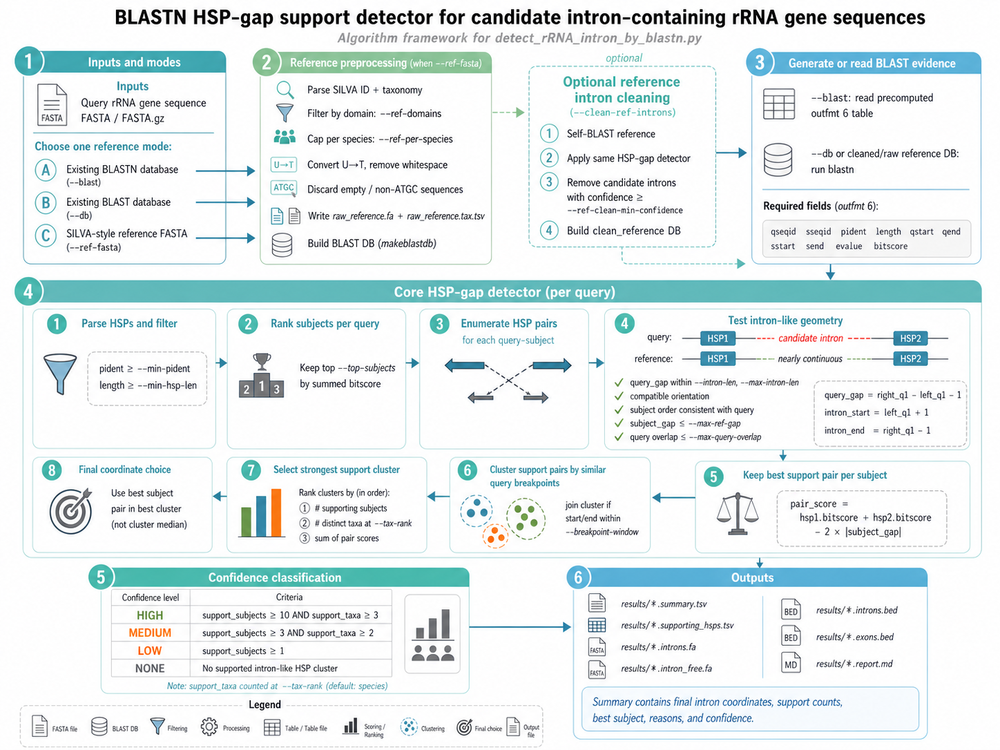
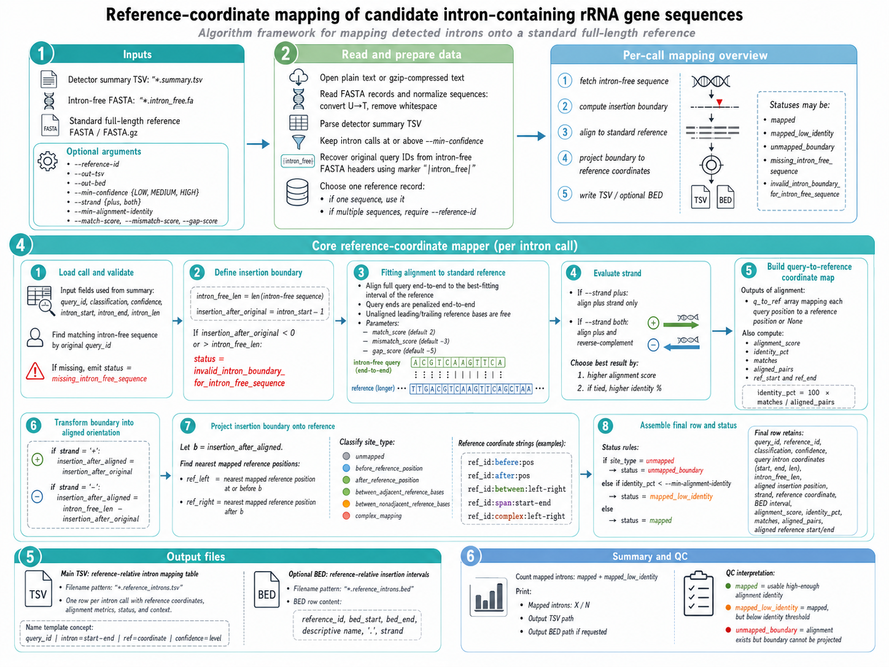

# detect-rRNA-intron-by-blastn

BLASTN HSP-gap support detector for candidate intron-containing 16S rRNA sequences.

This repository contains two command-line tools. `detect_rRNA_intron_by_blastn.py` scans 16S rRNA FASTA records for intron-like insertions, and `map_introns_to_reference.py` projects detected intron positions onto a standard full-length reference coordinate system.

```text
query:     [HSP 1] ---- candidate intron ---- [HSP 2]
reference: [HSP 1] -- nearly continuous  -- [HSP 2]
```

The detector is intended as a candidate discovery and triage tool. It reports supported insertion coordinates, exports the inferred intron sequence, and writes an intron-free version of each supported query sequence.

## Highlights

- Accepts an existing BLASTN table, an existing BLAST database, or a SILVA-style reference FASTA.
- Can preprocess SILVA-style reference records by domain, species cap, and strict ATGC sequence content.
- Optionally self-BLASTs the reference and removes candidate introns before query screening.
- Uses split-HSP geometry and multiple reference subjects to assign LOW, MEDIUM, or HIGH confidence.
- Reports final intron coordinates from the best supporting subject pair, not from a cluster median.
- Writes summary TSV, supporting-HSP TSV, intron FASTA, intron-free FASTA, BED files, and a Markdown report.
- Maps intron insertion sites from intron-containing query coordinates onto a standard reference sequence.

## Contents

- [Installation](#installation)
- [Quick Start](#quick-start)
- [Input Modes](#input-modes)
- [Reference-Coordinate Mapping](#reference-coordinate-mapping)
- [Algorithm Details](#algorithm-details)
- [Coordinate System](#coordinate-system)
- [Outputs](#outputs)
- [Parameters](#parameters)
- [Reference Preprocessing](#reference-preprocessing)
- [Reference Intron Cleaning](#reference-intron-cleaning)
- [Limitations](#limitations)
- [References](#references)

## Installation

Clone the repository and install the Python dependencies:

```bash
gh repo clone ypchan/detect_rRNA_intron_by_blastn
cd detect_rRNA_intron_by_blastn
python -m pip install -r requirements.txt
chmod 755 detect_rRNA_intron_by_blastn.py map_introns_to_reference.py
abspath=$(realpath detect_rRNA_intron_by_blastn.py)
ln -s ${abspath} "$HOME/bin"
```

For modes that run BLAST internally, install NCBI BLAST+ and make sure `blastn` and `makeblastdb` are available on `PATH`.

```bash
blastn -version
makeblastdb -version
```

The script itself is pure Python, but it shells out to BLAST+ when `--db` or `--ref-fasta` is used.

## Quick Start

### Use an existing BLASTN table

The BLAST table must be tab-delimited outfmt 6 with these fields:

```text
qseqid sseqid pident length qstart qend sstart send evalue bitscore
```

```bash
detect_rRNA_intron_by_blastn.py \
  --query query_16s.fa \
  --blast query_vs_reference.blastn.tsv \
  --taxonomy reference.tax.tsv \
  --outdir intron_scan
```

### Use an existing BLAST database

```bash
detect_rRNA_intron_by_blastn.py \
  --query query_16s.fa \
  --db /path/to/reference_db_prefix \
  --taxonomy reference.tax.tsv \
  --outdir intron_scan
```

### Build a database from a SILVA-style reference FASTA

The reference FASTA header should contain an ID followed by semicolon-delimited taxonomy:

```text
>AB000393.1.1510 Bacteria;Pseudomonadota;Gammaproteobacteria;...;Vibrio;Vibrio halioticoli
ACGT...
```

```bash
detect_rRNA_intron_by_blastn.py \
  --query query_16s.fa \
  --ref-fasta SILVA_16S_reference.fa.gz \
  --outdir intron_scan
```

## Input Modes

Exactly one of `--blast`, `--db`, or `--ref-fasta` must be supplied.

| Mode | What the script does | External tools |
|---|---|---|
| `--blast` | Reads a precomputed BLASTN outfmt 6 table. | None |
| `--db` | Runs `blastn` from query FASTA against an existing nucleotide BLAST database. | `blastn` |
| `--ref-fasta` | Filters a SILVA-style FASTA, writes reference FASTA and taxonomy TSV, builds a BLAST database, then runs `blastn`. | `makeblastdb`, `blastn` |

## Reference-Coordinate Mapping

After intron detection, use `map_introns_to_reference.py` to place each detected intron onto a standard full-length reference sequence, such as a curated 16S reference used by your project.

```bash
python map_introns_to_reference.py \
  --summary intron_scan/results/sample.summary.tsv \
  --intron-free-fasta intron_scan/results/sample.intron_free.fa \
  --reference standard_full_length_16s.fa \
  --out-tsv intron_scan/results/sample.reference_introns.tsv \
  --out-bed intron_scan/results/sample.reference_introns.bed
```

The mapping logic is:

1. Read each intron call from `*.summary.tsv`.
2. Convert the original query intron interval into an insertion boundary on the intron-free sequence:

```text
intron-free insertion boundary = after position (query intron_start - 1)
```

3. Align the intron-free sequence to the standard reference with a pure-Python fitting alignment. The full intron-free query is aligned, while unaligned leading and trailing reference bases are free. This supports both full-length and partial rRNA sequences.
4. If `--strand both` is used, align both the original intron-free sequence and its reverse complement, then keep the better-scoring orientation.
5. Project the intron-free insertion boundary through the alignment to the nearest mapped reference bases on the left and right.
6. Report the intron as a reference-relative insertion site, for example:

```text
standard_16S:between:788-789
```

This means the intron is inserted between reference positions 788 and 789 in 1-based reference coordinates. If the flanking bases map across a reference gap or deletion, the script reports a `span` coordinate rather than pretending the site is exact.

## Algorithm Details
### detect_rRAN_intron_by_blastn.py



### map introns to reference.py



### 1. HSP parsing and filtering

BLAST rows are parsed into HSP objects with query coordinates, subject coordinates, percent identity, alignment length, e-value, and bitscore. Rows are kept only if:

```text
pident >= --min-pident
length >= --min-hsp-len
```

By default, this means `pident >= 75.0` and `length >= 100`.

### 2. Subject ranking

For each query, the script ranks reference subjects by summed HSP bitscore and keeps the top `--top-subjects` subjects. The default is `100`.

### 3. Candidate HSP-pair geometry

For each query-subject pair, every pair of HSPs is tested. The two HSPs are sorted by query coordinate:

```text
left  = earlier HSP on the query
right = later HSP on the query
```

The query gap is:

```text
query_gap = right.qlo - left.qhi - 1
```

A pair supports an intron-like insertion only if:

- `query_gap` is between `--min-intron-len` and `--max-intron-len`.
- The two HSPs have compatible query/subject orientation.
- The subject coordinates are in the same biological order implied by the query.
- The subject gap or overlap is small enough: `abs(subject_gap) <= --max-ref-gap`.
- If query HSPs overlap, the overlap cannot exceed `--max-query-overlap`; with the default positive `--min-intron-len`, overlapping HSPs are normally rejected before output.

The candidate intron interval for that HSP pair is:

```text
intron_start = left.qhi + 1
intron_end   = right.qlo - 1
intron_len   = intron_end - intron_start + 1
```

### 4. Best pair per subject

Each subject contributes at most one support pair. If multiple HSP pairs on the same subject pass the geometry filters, the script keeps the highest-scoring pair:

```text
pair_score = hsp1.bitscore + hsp2.bitscore - 2 * abs(subject_gap)
```

This favors strong BLAST support and penalizes discontinuity in the reference.

### 5. Breakpoint clustering

Support pairs from different subjects are clustered by their query breakpoints. A pair joins an existing cluster when both start and end coordinates are within `--breakpoint-window` bp of that cluster's current median start and median end.

Clusters are ranked by:

1. Number of supporting subjects.
2. Number of distinct taxa at `--tax-rank`.
3. Sum of support-pair scores.

The highest-ranked cluster becomes the best support cluster.

### 6. Final coordinate choice

The final intron coordinates are taken from the best subject pair inside the best support cluster:

```text
best_subject_pair = highest pair_score in best_cluster
final_start       = best_subject_pair.intron_start
final_end         = best_subject_pair.intron_end
```

The script does not use median cluster coordinates for the final intron start and end. Cluster medians are used only to group nearby support pairs during clustering.

### 7. Confidence classification

The confidence label depends on how many reference subjects and taxa support the best cluster:

| Confidence | Default rule |
|---|---|
| HIGH | `support_subjects >= 10` and `support_taxa >= 3` |
| MEDIUM | `support_subjects >= 3` and `support_taxa >= 2` |
| LOW | `support_subjects >= 1` |
| NONE | No supported intron-like HSP cluster |

The taxonomic support rank is controlled by `--tax-rank`, default `species`.

## Coordinate System

Summary TSV and FASTA headers use 1-based inclusive coordinates:

```text
intron_start = first intron base in the query
intron_end   = last intron base in the query
```

BED outputs use standard BED coordinates:

```text
BED start = intron_start - 1
BED end   = intron_end
```

## Outputs

For a query FASTA named `sample.fa`, outputs are written under:

```text
<outdir>/
  blast/
  reference/
  results/
```

Main result files:

| File | Description |
|---|---|
| `results/sample.summary.tsv` | Query-level classification, final intron coordinates, support counts, best subject, and reasons. |
| `results/sample.supporting_hsps.tsv` | Subject-level HSP pairs supporting the chosen breakpoint cluster. |
| `results/sample.intron_free.fa` | Query sequences with the called intron removed. |
| `results/sample.introns.fa` | Extracted candidate intron sequences. |
| `results/sample.introns.bed` | Candidate intron intervals in BED format. |
| `results/sample.exons.bed` | Exon intervals flanking each candidate intron. |
| `results/sample.report.md` | Human-readable run report with inputs, parameters, counts, and top candidates. |

Reference-coordinate mapping files from `map_introns_to_reference.py`:

| File | Description |
|---|---|
| `results/sample.reference_introns.tsv` | Reference-relative intron insertion positions, mapping status, alignment identity, orientation, and flanking reference coordinates. |
| `results/sample.reference_introns.bed` | Optional BED representation of mapped insertion sites or uncertainty intervals on the standard reference. |

Reference-mode intermediates:

| File | Description |
|---|---|
| `reference/raw_reference.fa` | Filtered reference FASTA generated from `--ref-fasta`. |
| `reference/raw_reference.tax.tsv` | Subject-to-taxonomy table generated from SILVA-style headers. |
| `reference/raw_reference_db.*` | BLAST database files built from the filtered reference. |
| `reference/cleaned_reference.fa` | Optional intron-cleaned reference FASTA. |
| `reference/cleaned_reference.tax.tsv` | Taxonomy table for the cleaned reference. |
| `reference/reference_self_clean.*` | Optional self-BLAST cleaning reports. |

## Parameters

### Required inputs

| Parameter | Type | Default | Description |
|---|---:|---:|---|
| `--query` | path | none | Query 16S FASTA or FASTA.gz file. Required. |
| `--blast` | path | none | Existing BLASTN outfmt 6 table. Provide exactly one of `--blast`, `--db`, or `--ref-fasta`. |
| `--db` | path | none | Existing nucleotide BLAST database prefix. Provide exactly one of `--blast`, `--db`, or `--ref-fasta`. |
| `--ref-fasta` | path | none | SILVA-style reference FASTA or FASTA.gz. Provide exactly one of `--blast`, `--db`, or `--ref-fasta`. |
| `--outdir` | path | none | Output directory. Required. |

### Algorithm

| Parameter | Type | Default | Description |
|---|---:|---:|---|
| `--algorithm` | choice | `hsp-gap-support` | Detection algorithm. Currently only `hsp-gap-support` is implemented. |

### Reference preprocessing and HSP filters

| Parameter | Type | Default | Description |
|---|---:|---:|---|
| `--ref-domains` | string | `Archaea,Bacteria` | Comma-separated SILVA taxonomy domains retained when using `--ref-fasta`. |
| `--ref-per-species` | integer | `5` | Maximum reference sequences retained per species-level taxonomy key. Use `0` to disable this cap. |
| `--clean-ref-introns` | flag | disabled | Self-BLAST the reference and remove candidate introns before query BLAST. |
| `--ref-clean-min-confidence` | choice | `LOW` | Minimum confidence required to remove a reference intron during reference cleaning. Choices: `LOW`, `MEDIUM`, `HIGH`. |
| `--ref-self-blast-max-target-seqs` | integer | `100` | `blastn -max_target_seqs` value for reference self-BLAST. |
| `--ref-self-blast-max-hsps` | integer | `20` | `blastn -max_hsps` value for reference self-BLAST. |
| `--min-pident` | float | `75.0` | Minimum BLAST HSP percent identity retained for analysis. |
| `--min-hsp-len` | integer | `100` | Minimum BLAST HSP alignment length retained for analysis. |
| `--top-subjects` | integer | `100` | Number of top reference subjects retained per query after ranking by summed bitscore. |
| `--makeblastdb-bin` | string | `makeblastdb` | Executable name or path for `makeblastdb`. |
| `--blastn-bin` | string | `blastn` | Executable name or path for `blastn`. |
| `--blast-max-target-seqs` | integer | `100` | `blastn -max_target_seqs` value for query BLAST. |
| `--blast-max-hsps` | integer | `20` | `blastn -max_hsps` value for query BLAST. |
| `--blast-task` | choice | `blastn` | BLASTN task. Choices: `blastn`, `megablast`, `dc-megablast`, `blastn-short`. |
| `--blast-evalue` | string | `1e-20` | BLASTN e-value threshold passed to `blastn`. |

### Candidate intron geometry

| Parameter | Type | Default | Description |
|---|---:|---:|---|
| `--min-intron-len` | integer | `25` | Minimum query gap length considered a candidate intron. |
| `--max-intron-len` | integer | `2000` | Maximum query gap length considered a candidate intron. |
| `--max-ref-gap` | integer | `30` | Maximum absolute reference gap or overlap between the two HSPs. Small values enforce reference continuity. |
| `--max-query-overlap` | integer | `20` | Maximum tolerated query HSP overlap before rejecting a pair. With default positive `--min-intron-len`, overlapping pairs are not emitted as introns. |
| `--breakpoint-window` | integer | `30` | Maximum coordinate distance used to cluster support pairs with similar intron starts and ends. |

### Taxonomy support

| Parameter | Type | Default | Description |
|---|---:|---:|---|
| `--taxonomy` | path | none | Optional two-column TSV mapping `subject_id` to semicolon-delimited taxonomy. Generated automatically when `--ref-fasta` is used. |
| `--tax-rank` | choice | `species` | Taxonomic rank used to count distinct support taxa. Choices: `domain`, `phylum`, `class`, `order`, `family`, `genus`, `species`. |

### Confidence thresholds

| Parameter | Type | Default | Description |
|---|---:|---:|---|
| `--min-support-subjects` | integer | `1` | Minimum number of supporting subjects for LOW confidence. |
| `--medium-support-subjects` | integer | `3` | Minimum number of supporting subjects for MEDIUM confidence. |
| `--medium-support-taxa` | integer | `2` | Minimum number of distinct taxa at `--tax-rank` for MEDIUM confidence. |
| `--high-support-subjects` | integer | `10` | Minimum number of supporting subjects for HIGH confidence. |
| `--high-support-taxa` | integer | `3` | Minimum number of distinct taxa at `--tax-rank` for HIGH confidence. |
| `--min-output-confidence` | choice | `LOW` | Minimum confidence written to FASTA and BED outputs. Choices: `LOW`, `MEDIUM`, `HIGH`. |

### Runtime and logging

| Parameter | Type | Default | Description |
|---|---:|---:|---|
| `--threads` | integer | `4` | Worker threads for query analysis; also passed to BLASTN as `-num_threads`. |
| `--verbose` | flag | disabled | Print debug-level logs. |

### Reference mapping utility

These parameters belong to `map_introns_to_reference.py`.

| Parameter | Type | Default | Description |
|---|---:|---:|---|
| `--summary` | path | none | Summary TSV from `detect_rRNA_intron_by_blastn.py`. Required. |
| `--intron-free-fasta` | path | none | Intron-free FASTA from `detect_rRNA_intron_by_blastn.py`. Required. |
| `--reference` | path | none | Standard full-length reference FASTA/FASTA.gz. Required. |
| `--reference-id` | string | none | Reference record ID to use when the reference FASTA contains more than one sequence. |
| `--out-tsv` | path | derived from `--summary` | Output TSV with reference-relative coordinates. |
| `--out-bed` | path | none | Optional BED output path for mapped insertion sites. |
| `--min-confidence` | choice | `LOW` | Minimum intron confidence from the detector summary to map. Choices: `LOW`, `MEDIUM`, `HIGH`. |
| `--strand` | choice | `both` | Use only plus-strand alignment or choose the better of plus and reverse-complement alignments. Choices: `plus`, `both`. |
| `--min-alignment-identity` | float | `0.0` | Flag mapped rows below this percent identity as `mapped_low_identity`. |
| `--match-score` | integer | `2` | Match score for the internal fitting alignment. |
| `--mismatch-score` | integer | `-3` | Mismatch score for the internal fitting alignment. |
| `--gap-score` | integer | `-5` | Linear gap score for the internal fitting alignment. |

## Reference Preprocessing

When `--ref-fasta` is used, the script expects SILVA-style headers:

```text
>sequence_id taxonomy;fields;separated;by;semicolons
```

For each reference record, the script:

1. Parses the sequence ID and taxonomy from the FASTA header.
2. Keeps only records whose first taxonomy field is listed in `--ref-domains`.
3. Joins sequence lines, uppercases bases, converts `U` to `T`, and removes whitespace.
4. Discards empty sequences.
5. Discards sequences containing bases outside `A`, `T`, `G`, and `C`.
6. Applies the `--ref-per-species` cap using the first seven taxonomy fields as the species key.
7. Writes `reference/raw_reference.fa` and `reference/raw_reference.tax.tsv`.
8. Builds a nucleotide BLAST database with `makeblastdb`.

## Reference Intron Cleaning

If `--clean-ref-introns` is enabled, the script performs a reference self-BLAST:

1. Runs BLASTN with the filtered reference FASTA as both query source and database target.
2. Applies the same HSP-gap detector to each reference sequence.
3. Writes self-cleaning summary, HSP support, and report files.
4. Removes candidate intron intervals from reference sequences whose confidence is at least `--ref-clean-min-confidence`.
5. Builds a second BLAST database from `reference/cleaned_reference.fa`.
6. Uses the cleaned database for the final query BLAST.

This option is useful when the reference set may itself contain intron-bearing 16S records that would reduce the contrast between query insertions and reference continuity.

## Limitations

- This is a BLAST split-HSP detector, not a splice-site validator.
- It does not verify group I/group II intron secondary structure, catalytic motifs, or self-splicing ability.
- The final coordinate is only as reliable as the best supporting BLAST HSP pair in the best support cluster.
- Closely related reference sequences generally improve breakpoint precision.
- Very fragmented assemblies, chimeric 16S sequences, poor reference coverage, or repetitive regions can create false positives.
- If no taxonomy table is supplied, confidence can still be LOW, but MEDIUM/HIGH support based on taxonomic diversity may be limited.
- Reference-coordinate mapping depends on the chosen standard reference. A distant reference can shift or broaden the projected insertion site.
- `map_introns_to_reference.py` uses a simple linear-gap fitting alignment, which is transparent and dependency-free but not a substitute for careful manual curation of difficult alignments.

## References

- Altschul, S. F., Gish, W., Miller, W., Myers, E. W., and Lipman, D. J. Basic local alignment search tool. *Journal of Molecular Biology* 215, 403-410 (1990). DOI: [10.1016/S0022-2836(05)80360-2](https://doi.org/10.1016/S0022-2836(05)80360-2). PubMed: [2231712](https://pubmed.ncbi.nlm.nih.gov/2231712/).
- Camacho, C., Coulouris, G., Avagyan, V., et al. BLAST+: architecture and applications. *BMC Bioinformatics* 10, 421 (2009). DOI: [10.1186/1471-2105-10-421](https://doi.org/10.1186/1471-2105-10-421).
- NCBI. *BLAST Command Line Applications User Manual*. The command-line BLAST+ manual documents `blastn`, `makeblastdb`, tasks, custom tabular output, and database creation. [NCBI Bookshelf](https://www.ncbi.nlm.nih.gov/books/NBK279690/).
- Quast, C., Pruesse, E., Yilmaz, P., et al. The SILVA ribosomal RNA gene database project: improved data processing and web-based tools. *Nucleic Acids Research* 41(D1), D590-D596 (2013). DOI: [10.1093/nar/gks1219](https://doi.org/10.1093/nar/gks1219).
- Salman, V., Amann, R., Shub, D. A., and Schulz-Vogt, H. N. Multiple self-splicing introns in the 16S rRNA genes of giant sulfur bacteria. *Proceedings of the National Academy of Sciences* 109, 4203-4208 (2012). DOI: [10.1073/pnas.1120192109](https://doi.org/10.1073/pnas.1120192109).
- Hausner, G., Hafez, M., and Edgell, D. R. Bacterial group I introns: mobile RNA catalysts. *Mobile DNA* 5, 8 (2014). DOI: [10.1186/1759-8753-5-8](https://doi.org/10.1186/1759-8753-5-8).
